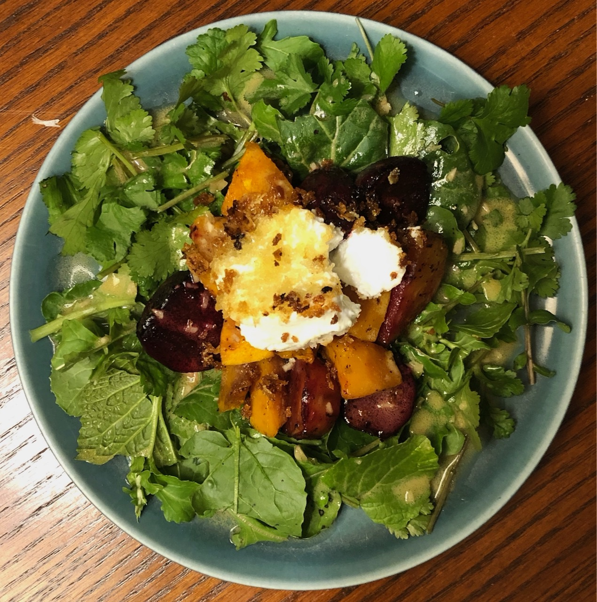

Simple and elegant and on all the restaurant menus but this one is better because you actually roast the beets!

{:height="400px"}

**Ingredients:**
- salad greens
- 4 large beets
- 1 4-oz log of fresh goat cheese
- Panko breadcrumbs or fine cornmeal
- vinaigrette of your choice

Peel the beets and cut them into bite-sized chunks. Toss them in olive oil and sprinkle with a bit of salt.

Put the beets into a baking dish and cover with foil and roast at 375˚ for about 30-40 minutes, until they're tender. Remove the foil and roast a bit longer, till they start to get a little caramelized.

Wash the salad and arrange it on four plates.

Cut the goat cheese into four sections (carefully so that ideally each piece stays in a chunk).

Heat a non-stick skillet and pour four little puddles of olive oil into it, and sprinkle each one with a layer of panko, about the size of the goat cheese chunks. Put one of the goat cheese chunks onto each little panko island and cook over medium heat until the panko starts to be browned and the goat cheese is starting to melt a little at the bottom. (It doesn't have to be melted or hot all the way through.) You can also do this in a toaster oven.

Scatter the beets onto the salad greens, drizzle with vinaigrette, and top each serving with a chunk of goat cheese.

