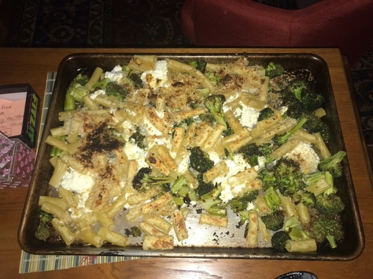

Mom suggested this recipe, originally posted in the New York Times. It is easy, delicious, and just slightly unusual (given the cumin seeds and spicy flavoring.)

{:height="400px"}

**Ingredients:**
- 2 ½ lbs of broccoli, cut into bite-size florets
- 2 tablespoons olive oil
- 1 teaspoon cumin seeds (optional)
- ¾ teaspoon kosher salt, plus more as needed
- ½ teaspoon red-pepper flakes, or to taste
- 12 ounces tube-shaped pasta (chiocciole or other)
- ⅓ cup grated Parmesan
- ⅓ cup panko bread crumbs
- 1 tablespoon finely grated lemon zest
- ½ teaspoon black pepper
- 12 oz whole milk ricotta

Time: 20 minutes
Yield: 4 servings

**Instructions:**
#Heat oven to 425 degrees. On rimmed baking sheet toss broccoli, oil, cumin (if using), ¾ teaspoon salt and red-pepper flakes. Roast until tender and browned at the edges, 18–24 minutes, tossing halfway through. Remote and set oven to broil.

#Bring pot of salted water to boil and cook pasta.

#In small bowl stir together Parmesan, panko, lemon zest, pinch of salt and the black pepper.

#Toss cooked pasta with broccoli on baking sheet, Season with salt/pepper to taste, dollop with ricotta. Then sprinkle with Parmesan mix, drizzle generously with oil, and broil until top is crisped and golden, 2 to 3 minutes.
